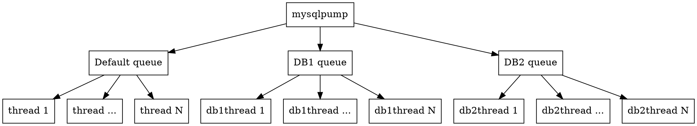

#mysql备份及恢复

## mysqldump - 数据备份命令

**特别说明**
* 以下命令只针对linux下有效，对于windows则没有测试，不保证准确性。
* **mysqldump**在备份较小量的数据时具有优势，在备份大数据时，请慎用次方案，因为不但备份慢，恢复更慢。
* 对于大数据的备份恢复请参考**mysqlbackup**企业级命令或者下面方案
* 参考mysql8.0的手册进行整理翻译，操作时可针对实际情况进行变动

**性能说明**
* **mysqldump**再导出大数据时，因为它在导出前是先输出到缓冲区中，因此可能出现问题，请使用--quick选项防止此问题。启用之后会进行逐行转储。

**调用语法**
```sql {.line-numbers}
mysqldump [options] dbname [tablename ...]
mysqldump [options] --database dbname ...
mysqldump [options] --alldatabase
```

**常用连接选项**
>* -u 用户名 默认root
>* -p 用户密码
>* -h host地址 默认127.0.0.1
>* -P 端口 默认3306

**DDL选项**
>* --add-drop-database 在每个create database前增加 drop database语句，一般和--database或者--all-database连用
>* --add-drop-table 在create table前增加 drop table
>* --add-drop-trigger 在create trigger前增加 drop trigger
>* --no-create-db 不输出 create database 语句
>* --no-create-info 不出处 create table 语句
>* --replace 使用replace代替insert语句进行输出

**国际化选项**
>* --default-character-set=utf8mb4 如果不指定，则默认utf8
>* --set-charset 输出set names utf8mb4这个选项是默认开启的，如果禁用，请使用 --skip-set-charset

**过滤选项**
>* --all-database
>* --database 
特别说明下改选项可以显式转储preformance_schema数据库，--all-database不会转储改db
>* --events 
导出 create event
>* --ignore-table=dbname.tblname 
不导出指定的表，要忽略多个表，请多次使用该选项
>* --routines 
导出create procedure和create function
>* --tables 
指定导出的表名
>* --triggers 
导出 create trigger，该选项默认启用，如果禁用，请使用--skip-triggers
>* --where 
导出指定条件的行 --where='id>1'

**性能选项**
一般针对还原数据，例如insert
>* --disable-keys
用/*!40000 ALTER TABLE tbl_name DISABLE KEYS */; 和 /*!40000 ALTER TABLE tbl_name ENABLE KEYS */;包围insert语句，因为是先插入后创建索引，所以快，改选项仅对非唯一索引的myisam表有效
>* --extend-insert
在insert语句加上多个values的方式提高效率
>* --insert-ignore
使用 insert ignore代替insert语句
>* --max-allowed-packet=value
客户端和服务器端通信的缓冲区大小，默认24MB，最大1GB
>* --network-timeout
设置--max-allowed-packet=为最大值和设置最大的读写超时时间，改选项默认启用，禁用请使用--skip-network-timeout
>* --opt
在导出时有用，可以提供快速导出的能力，是因为它是同时启用了 --add-drop-table --add-locks --create-options --disable-keys --extended-insert --lock-tables --quick --set-charset. 这些选项。如果不想用个别的，请使用反向的命令禁止。
>* --quick
此项在导出大表时非常有用，它是强制**mysqldump**一次一行的导出，而不是一次导出并缓冲的缓存区。

**事务选项**
>* --add-locks
使用lock tables和unlock tables包围table表语句，可以提高恢复时的性能
>* --flush-logs, -F
在导出前刷新服务日志，需要reload权限。如果和--all-database选项一起使用，则在每个database导出前都刷新log。在使用--lock-all-tables, --master-data或 --single-transaction这几个命令时，logs只刷新一次，相当于所有表被flush_tables_with_read_lock命名锁定时。
>* --lock-all-tables
在dump过程中锁定所有表，这个命令会自动关闭 --single-transaction和--lock-tables命令
>* --lock-tables
在导出database时锁定所有tables，tables使用read lock保持并发时的插入能力，仅对myisam有效，对于事务型的innodb表，请使用--single-transaction命令
>* --no-autocommit
使用set autocommit=0和commit包围insert语句
>* --single-transactions
设置事务格力模式为repeatable_read并且在导出前向服务器发送start transaction命令。仅用于事务类型的表，如innodb。此命令和--lock-tables互斥。因为lock tables命令会立即提交事务。

**用例**
* 备份整表
```sql {.line-numbers}
mysqldump -uroot -p --all-database > /home/alldb.sql
```
* 恢复文件
```sql {.line-numbers}
mysqldump -uroot -p dbname < /home/alldb.sql
```
* 另一种恢复文件的方式
```sql {.line-numbers}
mysqldump -uroot -p -e "source /home/alldb.sql" dbname
```
* 从一个服务器复制到另外一个服务器上
```sql {.line-numbers}
mysqldump -uroot -p --opt dbname | mysql -uroot -p123 -C dbname
```

## mysqlpump - 另一个数据备份命令
**和mysqldump的区别**
* 其实**mysqlpump**是**mysqldump**的加强版，主要是增加了并行处理的能力。
使用队列+线程，允许有多个队列，每个队列下有多个线程，一个队列可以绑定1个或多个数据库，从而提升备份的速度。


**mysqlpump**的优势

>* 基于表并行备份数据库和数据库中的对象，加快备份过程。
>* 更好的控制数据库和数据库对象（表、存储过程、用户账户）的备份
>* 备份用户账户作为管理语句，（create user, grant），而不是直接插入到mysql的系统数据库。
>* 备份出来直接生产压缩的备份文件
>* 备份进度指示，观察备份进度更直观
>* 重新加载（还原）备份文件，先建表后插入数据最后建立索引，减少索引的维护开销，加快恢复速度。
>* 备份可以排除或者指定数据库


**mysqlpump使用注意点**

>* 官方推荐在5.7.11后的版本使用。
>* **mysqlpump**的多线程备份是基于表的，当数据库中有多个小表个别大表时，备份速度是不如**mysqldump**。


**mysqlpump的基本参数**

>* --login-path=#              可以支持面密码备份数据
>* --character-sets-dir=name   指定备份数据导出字符集
>* --compress-output=name      将备份数据压缩输出，目前支持的压缩算法有LZ4和ZLIB
>* -B, --databases             指定备份数据库，多个库之间用逗号分隔
>* --default-parallelism=#     备份并行线程数，默认为2，若指定该参数为0，则表示不使用并行备份。
>* --defer-table-indexes 	  延迟创建索引，将全部数据备份结束后再创建索引，默认开启。使用mysqldump备份时会先创建表和索引，然后加载原数据，资源消耗不仅有备份还有对二级索引的维护
>* --exclude-databases=name    备份时排除该参数指定的数据库，多个数据库之前使用,分隔
>* --exclude-tables=name       备份时排除该参数指定的表，多个表之前使用,分隔
>* --include-databases=name    备份指定数据库，多个数据库之前使用,分隔
>* --include-tables=name       备份指定表，多个表之前使用,分隔
>* --parallel-schemas=[N:]db_list    指定并行备份的库，多个库之间用逗号分隔。也可以直接指定备份该库启用的线程队列数，若不指定则有-default-parallelism参数决定，默认为2。  
>* -d, --skip-dump-rows        只备份表结构，不备份数据
>* --users                     备份数据库用户，备份形式为create user ... ,grant .... 如果只需要备份数据库账号可以使用 mysqlpump --exclude-databases=% --users
>* --watch-progress            显示备份进度，默认开启
>* --single-transaction        对于innodb表，在备份开始的时候会开启一个事物，并且设置隔离级别为RR，保证备份数据的一致性。备份期间应避免DDL。
在MySQL5.7.11之前，--defaut-parallelism大于1的时候和该参数互斥，所以必须使用--default-parallelism=0。MySQL 5.7.11后解决了--single-transaction和--default-parallelism互斥的问题。

##二进制日志备份及恢复

**开启二进制日志**

* 说明
记录了所有的DDL和DML语句，以事件形式记录，还包含语句所执行的消耗的时间，MySQL的二进制日志是事务安全型的
DDL (data defined language) [create table/view/index/syn/cluster |alter|drop]
DML (data manipulation language) [update|insert|delete]


* vim my.cnf

>1. log-bin=mysql-bin    #开启binlog.文件存储位置：如果是全路径，生成的日志文件就在指定的目录下；如果只给一个名字，那么一般在mysql/data下
>2. server-id	  = 1   #设置唯一id 范围between 1 and 2^32 - 1
>3. binlog-format = MIXED  #


* 指令
>1. show master logs   #查看所有binlog日志文件列表
>2. show master status #查看最新一个binlog日志的名称以及最后一个操作的end_position
>3. flush logs         #立即开启一个新编号的日志文件，mysql重启或者mysqldump -F 时都会自动调用该命令
>4. reset master       #清空所有binlog文件


**二进制恢复**
* mysqlbinlog mysql-bin.000001 | mysql -uroot -p
* mysqlbinlog -vv --base64-output=decode-rows --stop-position=5586478 --database=edu_v2 mysql-bin.000001 > /home/000001.sql
> -vv 查看具体SQL语句及备注。
> --base64-output=decode-rows：解码。
> --stop-position=5586478 停止读取二进制位置
> --database=edu_v2 只读指定取数据库
* mysql < /home/000001.sql
* mysql -e "source /home/000001.sql" dbname


##物理备份
**innodb物理备份**
* 在mysql/data的文件夹对应的dbfile下
> *.frm 存储结构
> *.ibd 存储数据

**恢复**
>1. 创建数据库，创建数据表。
>2. 确保创建表的row_format和idb的row_format一致
>3. set global innodb_file_format=Barracuda; 设置row_format格式
>5. lock tables tbl_name write;
>4. 移除表空间
alter table tbl_name discard tablespace;
>5. 将idb文件拷贝到mysql/data下面
>6. 重新导入表空间
alter table tbl_name import tablespace;
>7. unlock tbl_name;